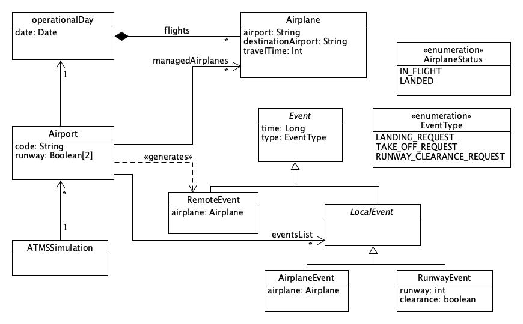
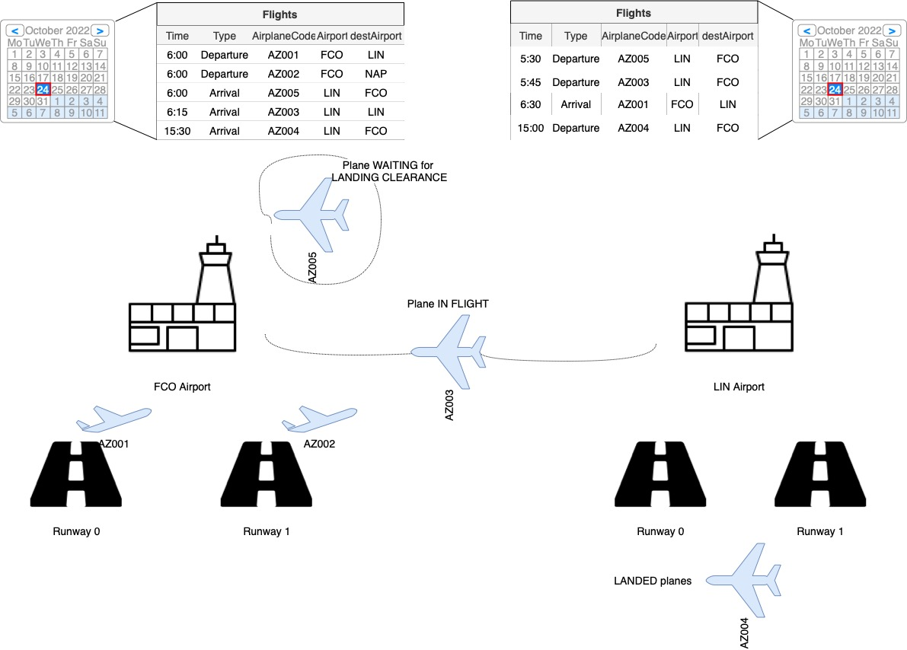
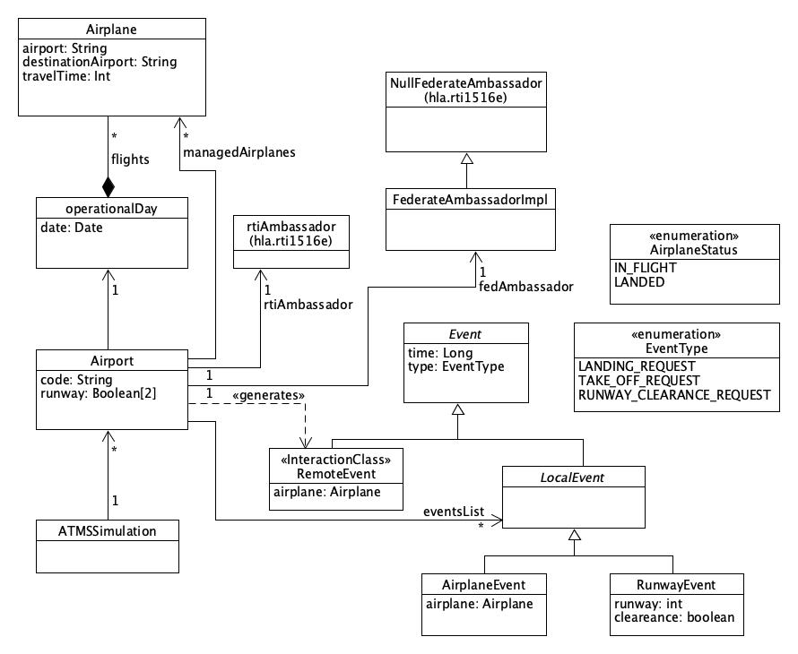

Un progetto di **Michele Cirillo** per il corso di Internet Based Distributed Simulation (IBDS) dell'università "Tor Vergata" in Roma.

# Requisiti applicativi
Si vuole studiare il caso di un sistema di gestione del traffico aereo, in particolare 
si vuole simulare l'arrivo, l'atterragio ed il decollo di aerei da e per diversi aereoporti (almeno 
2)\
Si voglio seguire i seguenti requisiti:

- Ogni aeroporto è provvisto di 2 piste per l'atterraggio/decollo
	- In caso entrambe siano occupate, si adotta una politica FIFO per la coda d'attesa
- Un aereo che arriva ad un aeroporto attende un tempo predefinito al gate e successivamente decolla verso 
un altro aeroporto (che potrebbe essere parte del sistema o no).
- Gli aerei sono caratterizzati da proprietà come *aeroporto*, *aeroporto di destinazione*, 
*tempo di viaggio*
- Gli arrivi e le partenze di ogni aeroporto sono schedulate secondo un calendario 
giornaliero predefinito.
	- Il sistema deve essere analizzato durante un'intera giornata operativa: dalle 5:00 
	AM alle 11:00 PM
	
## Ulteriori assunzioni
Consideriamo le seguenti assunzioni e/o limitazioni:

- A causa della limitazione del software implementativo, gli aereoporti saranno esattamente 2 
  (comunque almeno 2, come richiesto nei requisiti). Nello specifico, saranno: 
  - L'aeroporto di Roma Fiumicino (FCO)
  - L'aeroporto di Milano Linate (LIN) 
- Ogni aeroporto ha una torre di controllo che dà l'autorizzazione ad ogni aereo di 
atterrare o decollare
	- In caso le piste siano occupate, l'aereo che sta attendendo fa una nuova richiesta di decollo o atterraggio 
	dopo un tempo predefinito di 10 minuti.
- L'uso della pista per il decollo e l'atterraggio richiede un tempo predefinito maggiore di 0.
	- Assumiamo questo tempo sia di 10 minuti.
- Un aereo dopo l'atterraggio, passa un tempo di 30 minuti al gate prima di partire 
  di nuovo
- Un aeroporto può schedulare soltanto una partenza (**departure**) verso un qualunque 
altro aeroporto (del sistema o no).

# Analisi dei requisiti
Consideriamo la seguente tabella:

|Req|Breve descrizione|Scelta progettuale|
|-|------|-----|
|R1|Ogni aeroporto ha 2 piste|Ariport Class, runway array attribute|
|R2|Un aereo che arriva attende e dopo decolla di nuovo|Una richiesta di atterraggio genera una nuova richiesta di decollo|
|R3|Gli aerei sono caratterizzati da aeroporto, aeroporto di destinazione e tempo di viaggio|Airplane Class; airport, destination airport and travel time attributes|
|R4|Calendario giornaliero per gli arrivi e le partenze|operationalDay Class|

# Preliminary Design 
Consideriamo il seguente UML Class Diagram:

{width=90%}

- *ATMSSImulation* contiene il main della simulazione, instanzia lo scenario ed il federato 
associato (FCO o LIN)
- *Airport* è il federato della simulazione
	- *code* indica il codice dell'aeroporto (FCO o LIN nel nostro esempio)
	- *runway* contiene due booleani che indicano se le rispettive piste sono occupate 
	o no
	- Il calendario giornaliero è rappresentato da una collezione di _operationalDay_
- *operationalDay* contiene tutti i voli schedulati in una giornata di lavoro dell'aeroporto corrispondente
- *Airplane* è una classe che identifica gli aerei, caratterizzati dall'*airport*, 
*destinationAirport* e *travelTime*
- *Event* indica un generico evento
	- *time* indica il timestamp dell'evento
	- *type* indica il tipo dell'evento
- _LocalEvent_ indica un evento locale all'aeroporto, che può essere uno dei seguenti 
due sottotipi:
	- _AirplaneEvent_ è l'evento di atterraggio o decollo che riguarda un aereo, il suo 
  _EventType_ può essere quindi _LANDING_REQUEST_ o _TAKE_OFF_REQUEST_ 
 	- _RunwayEvent_ è l'evento che cambia lo status (_clearance_) di una pista (_runway_), 
   il suo _EventType_ è quindi _RUNWAY_CLEARANCE_REQUEST_ 
- _AirplaneStatus_ è un'enum che contiene tutti i possibili stati in cui può trovarsi un'aereo 
della simulazione
- _EventType_ è un'enum che contiene tutti i possibili tipi di eventi (sia remote che 
local)
  
\newpage

# Examples of scenarios
## Esempio 1

Consideriamo la seguente illustrazione di un possibile scenario:

Assumiamo di osservare la simulazione alle ore 6:00AM del 24 Ottobre e ci concentriamo sui singoli aerei. 
Assumiamo inoltre che il **travelTime** di ciascun aereo sia di 30 minuti.

- *AZ001* e *AZ002* stanno entrambi partendo dall'aeroporto FCO e stanno quindi occupando le due piste 
disponibili
- *AZ003* che è partito alle ore 5\:45 da LIN è **IN FLIGHT** verso FCO
- *AZ004* è nello stato **LANDED** in attesa di partire da LIN alle ore 3:00PM
- *AZ005* è partito alle ore 5\:30 da LIN ed è arrivato a FCO, sta aspettando che una delle due piste di FCO si 
liberi per poter atterrare. 

\newpage

## Esempio 2

Consideriamo la seguente illustriazione di un possibile scenario:

Assumiamo di osservare la simulazione alle ore 17:00 del 25 Ottobre e ci concentriamo sui singolo aerei.
Assumiamo inoltre che il **travelTime** di ciascun aereo sia di 30 minuti e che gli 
aerei abbiano un tempo prestabilito di decollo (e quindi di utilizzo della pista) di 
almeno 5 minuti.

- _AZ001_ e _AZ002_ stanno entrambi decollando dall'aeroporto LIN e quindi utilizzano entrambe le piste disponibili
- _AZ003_ è appena arrivato all'aeroporto di FCO e sta per atterrare, siccome FCO ha almeno una pista non 
  occupata
- _AZ004_ è fermo (**LANDED**) all'aeroporto FCO
- _AZ005_ e _AZ006_ dovrebbero entrambi decollare alle 17:05 ma stanno aspettando che le 
piste di LIN si liberino
- _AZ007_ è in viaggio (**IN FLIGHT**) da FCO a LIN e si trova a metà via.

# HLA Object and Instances

Una volta prodotto il federation conceptual model che fornisce una descrizione astratta _platform 
independent_ delle entità che compongono la simulazione e delle loro relazioni statiche e dinamiche, ci 
concentriamo sui concetti relativi al modello HLA\: identificando i *federati*, gli _oggetti HLA_ 
e le *interazioni* tra i federati che compongono la *federazione*. 

|Object Model Element|HLA Mapping|
|--------------------|-----------|
|Airport|Federate|
|operationalDay|ObjectClass|
|Airplane|Not mapped (local entity)|

# Detailed Design

Passiamo quindi al raffinamento del model _platform independent_ in un modello _platform dependent_\: 
in questo caso il modello a oggetti **HLA**.

Facciamo riferimento alle differenze del __federation design__ rispetto al __federation conceptual model__

- A _operationalDay_ è stato aggiunto lo stereotipo \<\<ObjectClass>> per denotare che 
si tratta di un oggetto, nella concezione di oggetto HLA
- Sono state aggiunte le classi _rtiAmbassador_ e _FederateAmbassadorImpl_ che sono le classi che implementano la 
logica di comunicazione tra federati in una federazione HLA

Le restanti classi rimaste invariate verranno implementate nella concezione del classico 
modello a oggetti.

# Federation Object Model

Ora che sono state individuate le *entità*, gli *oggetti* e le _interazioni_ HLA, bisogna documentare l'interazione federazione in 
accordo con l'**OMT** (Object Model Template), producendo un **FOM** (Federation Object Model).

## Object Class Table
|Name|Superclass|Sharing|
|----|-----|----|
|operationalDay|HLAobjectRoot|P/S|

## Attributes Table
|Object|Name|Type|Update|Ownership|Sharing|Order|
|----|----|----|----|---|---|----|
|operationalDay|flightsScheduled|FlightScheduledRecord|Static|N|P/S|Timestamp|

## Synchronization Table
|Label|Capability|
|---|----|
|ReadyToRun|Register/Achieve|

## Data Types Table - Enumerated Data Type
|Name|Representation|Enum Name|Enum Value|
|---|----|----|---|
|EventType|HLAunicodeString|LANDING_REQUEST|1
|||TAKE_OFF_REQUEST|2|

## Data Types Table - Array Data Type
|Name|DataType|Cardinality|Encoding|
|----|----|---|----|
|FlightScheduledList|FlightScheduledRecord|Dynamic|HLAvariantArray|

## Data Types Table - Fixed Record Data Type
|Record name|Name|Type|Semantics|Encoding|Semantics|
|----|----|----|----|----|----|
|AirplaneRecord|flightCode|HLAunicodeString|Codice di volo dell'aereo|HLAfixedRecord|Rappresentazione HLA di un aereo|
||airport|HLAunicodeString|Codice dell'aeroporto di partenza|||
||destinationAirport|HLAunicodeString|Codice dell'aeroporto di destinazione|||
||travelTime|HLAinteger64BE|Tempo di volo|||
|FlightScheduledRecord|time|HLAinteger64Time|Minuto in cui è schedulato il volo|HLAfixedRecord|Tempo e aereo schedulato in un operational day|
||airplane|AirplaneRecord|Aereo schedulato|||
    